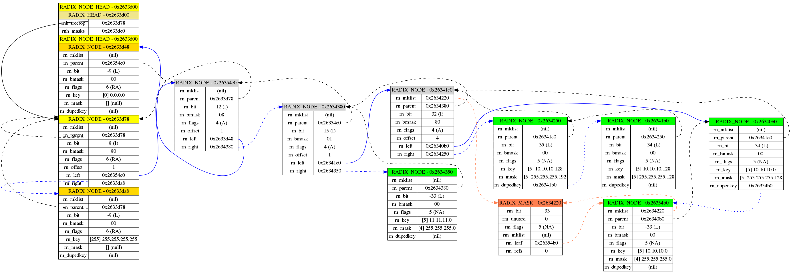
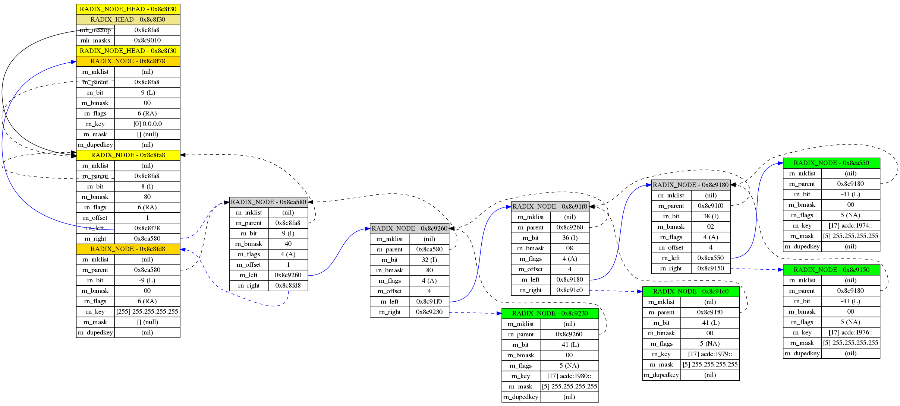
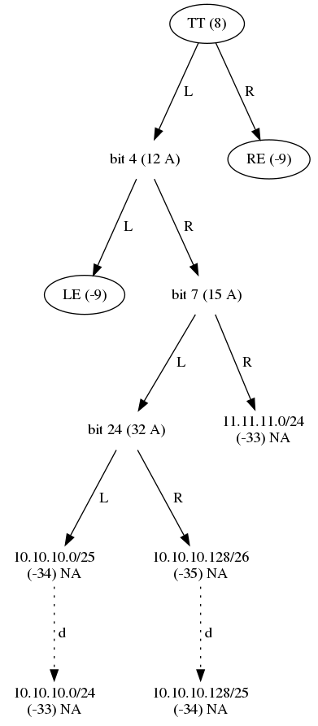
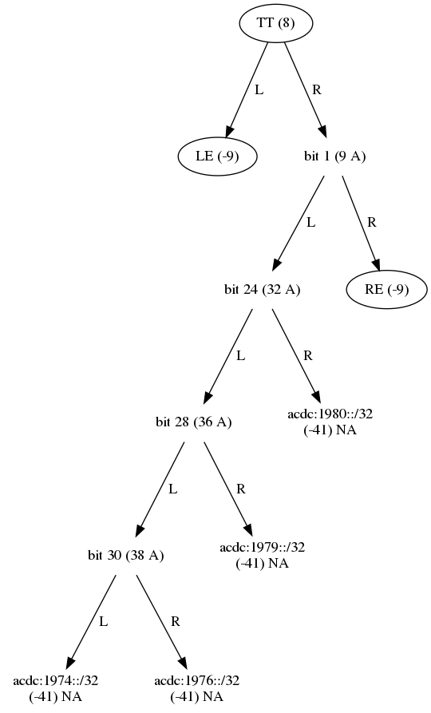

# iptable

A Lua binding to `iptable.c`, a thin wrapper around
[*radix.c*](https://raw.githubusercontent.com/freebsd/freebsd/master/sys/net/radix.c)
from the [*FreeBsd*](https://www.freebsd.org/) project which implements
a radix tree with one-way branching removed (a level collapsed trie).

`iptable` provides some convenience functions to work with ip addresses
and subnets (in CIDR notation) as well as a longest prefix matching
(Lua) table. It handles both ipv4 and ipv6 addresses and/or subnets
transparently.

## Requirements and limitations

`iptable` is developed on a linux machine and support for other OS’s is
non-existent at this point. The following is currently used to build
iptable:

    - Lua 5.3.5  Copyright (C) 1994-2018 Lua.org, PUC-Rio
    - Ubuntu 18.04 bionic 
    - gcc (Ubuntu 7.4.0-1ubuntu1~18.04.1) 7.4.0
    - GNU Make 4.1

`lua_iptable.c` uses Lua 5.3’s C-API, so Lua \>= 5.3 is required.
Additionally for testing and documentation, the following is used:

    - valgrind-3.13.0
    - busted 2.0.rc13-0
    - pandoc 2.7.3
    - pandoc-imagine 0.1.6

## Installation

### Install the Lua `iptable` library using make.

    cd ~/installs
    git clone https://github.com/hertogp/iptable.git
    cd iptable
    make test
    sudo -H make install
    # or
    make local_install    # simply copies to ~/.luarocks/lib/lua/5.3

### Install using luarocks

  - todo.

### Install only the C `iptable` library using make

Well, sort of:

    cd ~/installs
    git clone https://github.com/hertogp/iptable.git
    cd iptable
    make c_test
    make c_lib

There’s no `c_install` target to install the c-library, so from here it
boils down to manual labor.

## Usage

An iptable.new() yields a Lua table with modified indexing behaviour:

  - the table utilizes 2 separate radix trees for ipv4 and ipv6
    respectively
  - the table handles both ipv4 or ipv6 keys transparently
  - if a key is not an ipv4 or ipv6 subnet/address it is *ignored*
  - ipv4 and ipv6 subnets are always in CIDR notation: address/len
  - storing data always uses a subnet-key (address/mlen)
  - when storing data, missing masks default to the AF’s maximum mask
  - when storing data, masks are always applied first to the key
  - storing data is always based on an exact match which includes the
    mask
  - retrieving data with a subnet-key, uses an exact match
  - retrieving data with an address-key, uses a longest prefix match
  - count/size functions use Lua arithmatic, since ipv6 space is rather
    large
  - `mlen == -1` means some function (like `iptable.address(pfx)`) saw
    no mask

Example usage:

``` lua
ipt = require"iptable".new()

ipt["10.10.10.0/24"] = {seen=0}       -- store anything in the table
ipt["10.10.10.10"] = false            -- stores to ipt["10.10.10.10/32"]
ipt["11.11.11.11/24"] = true          -- stores to ipt["11.11.11.0/24"]
ipt["acdc:1974::/32"] = "Jailbreak"   -- goes into separate radix tree
ipt[1] = 42                           -- ignored: ipt[1] -> nil
#ipt                                  -- 4 entries in total
ipt.counts()                          -- 3  1  (ipv4 and ipv6 counts)

for k,v in pairs(ipt) do              -- 10.10.10.0/24    table 0x...
    print(k,v)                        -- 10.10.10.10/32   false
                                      -- 11.11.11.0/24    true
end                                   -- acdc:1974::/32   Jailbreak
```

# Quick reference

``` lua

iptable = require "iptable"

-- Module constants

iptable.AF_INET  --  2
iptable.AF_INET6 -- 10

-- Module functions

prefix = "10.10.10.0/24"                       -- ipv4/6 address or prefix

addr,  mlen, af = iptable.address(prefix)      -- 10.10.10.0   24  2
netw,  mlen, af = iptable.network(prefix)      -- 10.10.10.0   24  2
bcast, mlen, af = iptable.broadcast(prefix)    -- 10.10.10.255 24  2
neigb, mlen, af = iptable.neighbor(prefix)     -- 10.10.11.0   24  2

nxt,  mlen, af = iptable.incr(prefix)          -- 10.10.10.1   24  2
nxt,  mlen, af = iptable.incr(prefix, 257)     -- 10.10.11.1   24  2
prv,  mlen, af = iptable.decr(prefix)          -- 10.10.9.255  24  2
prv,  mlen, af = iptable.decr(prefix, 257)     -- 10.10.8.255  24  2

mask = iptable.mask(iptable.AF_INET, 24)       -- 255.255.255.0
size = iptable.size(prefix)                    -- 256

binkey = iptable.tobin("255.255.255.0")        -- byte string 05:ff:ff:ff:00
prefix = iptable.tostr(binkey)                 -- 255.255.255.0
msklen = iptable.masklen(binkey)               -- 24
ipt    = iptable.new()                         -- longest prefix match table

-- table functions

#ipt                                           -- 0 (nothing stored yet)
ipt:counts()                                   -- 0 0 (ipv4_count ipv6_count)
for k,v in pairs(ipt) do ... end               -- iterate across k,v-pairs
for k,v in ipt:more(prefix [,true]) ... end    -- iterate across more specifics
for k,v in ipt:less(prefix [,true]) ... end    -- iterate across less specifics
for k,v in ipt:masks(prefix [,true]) ... end   -- iterate across masks used
for k,g in ipt:merge(af) ... end               -- iterate across combinable pfx's
for rdx in ipt:radixes(af [,true]) ... end     -- dumps all radix nodes in tree

-- note: use `true` as 2nd (optional boolean) argument to:
--> include search `prefix` itself in search results if found, or
--> to also dump the radix nodes from the (separate) radix mask tree
```

# Documentation

See also the `doc` directory on
[github](https://github.com/hertogp/iptable).

## module constants

``` lua
iptable.AF_INET6    10
iptable.AF_INET     2
```

## module functions

Requiring `iptable` yields an object with module level functions.

``` lua
iptable = require "iptable"
```

### `iptable.address(prefix)`

Returns the host address, mask length and address family for `prefix`.

``` lua
#!/usr/bin/env lua
iptable = require"iptable"
pfx4 = "10.10.10.0/19"
pfx6 = "2001:0db8:85a3:0000:0000:8a2e:0370:700/120"

ip, mlen, af = iptable.address(pfx4)
print(string.format("-- ip %s, mlen %s, af %s", ip, mlen, af))

ip, mlen, af = iptable.address(pfx6)
print(string.format("-- ip %s, mlen %s, af %s", ip, mlen, af))

print(string.rep("-", 35))

---------- PRODUCES --------------
```

``` lua
-- ip 10.10.10.0, mlen 19, af 2
-- ip 2001:db8:85a3::8a2e:370:700, mlen 120, af 10
-----------------------------------
```

### `iptable.network(prefix)`

Applies the mask to the address and returns the network address, mask
length and address family for `prefix`.

``` lua
#!/usr/bin/env lua
iptable = require"iptable"
pfx4 = "10.10.10.10/19"
pfx6 = "2001:0db8:85a3:0000:0000:8a2e:0370:777/120"

ip, mlen, af = iptable.network(pfx4)
print(string.format("-- ip %s, mlen %s, af %s", ip, mlen, af))

ip, mlen, af = iptable.network(pfx6)
print(string.format("-- ip %s, mlen %s, af %s", ip, mlen, af))

print(string.rep("-", 35))

---------- PRODUCES --------------
```

``` lua
-- ip 10.10.0.0, mlen 19, af 2
-- ip 2001:db8:85a3::8a2e:370:700, mlen 120, af 10
-----------------------------------
```

### `iptable.broadcast(prefix)`

Applies the inverse mask to the address and returns the broadcast
address, mask length and address family for `prefix`.

``` lua
#!/usr/bin/env lua
iptable = require"iptable"
pfx4 = "10.10.10.0/19"
pfx6 = "2001:0db8:85a3:0000:0000:8a2e:0370:700/120"

ip, mlen, af = iptable.broadcast(pfx4)
print(string.format("-- ip %s, mlen %s, af %s", ip, mlen, af))

ip, mlen, af = iptable.broadcast(pfx6)
print(string.format("-- ip %s, mlen %s, af %s", ip, mlen, af))

print(string.rep("-", 35))

---------- PRODUCES --------------
```

``` lua
-- ip 10.10.31.255, mlen 19, af 2
-- ip 2001:db8:85a3::8a2e:370:7ff, mlen 120, af 10
-----------------------------------
```

### `iptable.incr(prefix [,offset])`

Increment the ip address of the prefix (no mask is applied) and return
the new ip address, mask length and address family. `offset` is optional
and defaults to 1.

``` lua
#!/usr/bin/env lua
iptable = require"iptable"
pfx4 = "10.10.10.0/19"
pfx6 = "2001:0db8:85a3:0000:0000:8a2e:0370:700/120"

ip, mlen, af = iptable.incr(pfx4)
print(string.format("-- ip %s, mlen %s, af %s", ip, mlen, af))

ip, mlen, af = iptable.incr(pfx4, 10)
print(string.format("-- ip %s, mlen %s, af %s", ip, mlen, af))

ip, mlen, af = iptable.incr(pfx6, 5)
print(string.format("-- ip %s, mlen %s, af %s", ip, mlen, af))

print(string.rep("-", 35))

---------- PRODUCES --------------
```

``` lua
-- ip 10.10.10.1, mlen 19, af 2
-- ip 10.10.10.10, mlen 19, af 2
-- ip 2001:db8:85a3::8a2e:370:705, mlen 120, af 10
-----------------------------------
```

### `iptable.decr(prefix [, offset])`

Decrement the ip address of the prefix (no mask is applied) and return
the new ip address, mask length and address family. `offset` is optional
and defaults to 1.

``` lua
#!/usr/bin/env lua
iptable = require"iptable"
pfx4 = "10.10.10.0/19"
pfx6 = "2001:0db8:85a3:0000:0000:8a2e:0370:700/120"

ip, mlen, af = iptable.decr(pfx4, 1)
print(string.format("-- ip %s, mlen %s, af %s", ip, mlen, af))

ip, mlen, af = iptable.decr(pfx6, 1)
print(string.format("-- ip %s, mlen %s, af %s", ip, mlen, af))

print(string.rep("-", 35))

---------- PRODUCES --------------
```

``` lua
-- ip 10.10.9.255, mlen 19, af 2
-- ip 2001:db8:85a3::8a2e:370:6ff, mlen 120, af 10
-----------------------------------
```

### `iptable.interval(start, stop)`

Iterate across the subnets that cover, exactly, the ip address space
bounded by the start and stop addresses.

``` lua
#!/usr/bin/env lua
iptable = require"iptable"

for pfx in iptable.interval("10.10.10.0", "10.10.10.12") do
    print("-- ", pfx)
end

print(string.rep("-", 35))

---------- PRODUCES --------------
```

``` lua
-- 	10.10.10.0/29
-- 	10.10.10.8/30
-- 	10.10.10.12/32
-----------------------------------
```

### `iptable.mask(af, mlen [, invert])`

Create a mask for the given address family `af` and specified mask
length `mlen`. Use the optional 3rd argument to request an inverted mask
by supplying a true value.

``` lua
#!/usr/bin/env lua
iptable = require"iptable"

print("--", iptable.mask(iptable.AF_INET, 19))
print("--", iptable.mask(iptable.AF_INET, 19, true))

print("--", iptable.mask(iptable.AF_INET6, 91))
print("--", iptable.mask(iptable.AF_INET6, 91, true))


print(string.rep("-", 35))

---------- PRODUCES --------------
```

``` lua
--	255.255.224.0
--	0.0.31.255
--	ffff:ffff:ffff:ffff:ffff:ffe0::
--	::1f:ffff:ffff
-----------------------------------
```

### `iptable.neighbor(prefix)`

Get the adjacent subnet that, together with `prefix`, occupies their
immediate parental supernet whose prefix length is 1 bit shorter.
Returns the adjacent prefix, mask length and address family. Note that a
prefix with no length has no parental supernet.

``` lua
#!/usr/bin/env lua
iptable = require"iptable"
pfx6 = "2001:0db8:85a3:0000:0000:8a2e:0370:700/120"

print("--", iptable.neighbor("10.10.0.0/19"))
print("--", iptable.neighbor("10.10.32.0/19"))
print("--", iptable.neighbor("10.10.10.255"))
print("--", iptable.neighbor("0.0.0.0/0"))      -- nothing larger than this
print("--", iptable.neighbor(pfx6))

print(string.rep("-", 35))

---------- PRODUCES --------------
```

``` lua
--	10.10.32.0	19	2
--	10.10.0.0	19	2
--	10.10.10.254	-1	2
--	nil
--	2001:db8:85a3::8a2e:370:600	120	10
-----------------------------------
```

### `iptable.size(prefix)`

Return the number of hosts covered by given `prefix`. Since ipv6 subnets
might have more than 2^52 hosts in it, this function uses Lua arithmatic
to yield the number.

``` lua
#!/usr/bin/env lua
iptable = require"iptable"
pfx6 = "2001:0db8:85a3:0000:0000:8a2e:0370:700/120"

print("--", iptable.size("10.10.10.0/24"))
print("--", iptable.size("10.10.0.0/31"))
print("--", iptable.size(pfx6))
print("--", iptable.size("2001::/0"))

print(string.rep("-", 35))

---------- PRODUCES --------------
```

``` lua
--	256.0
--	2.0
--	256.0
--	3.4028236692094e+38
-----------------------------------
```

### `iptable.tobin(prefix)`

Returns the binary key used internally by the radix tree for a string
key like `prefix`. It’s a length encoded byte string, i.e. the first
byte represents the length of the entire byte string and the remaining
bytes are from the prefix itself. Useful if the convenience functions
fall short of what needs to be done, or to figure out the mask length of
a regular mask.

``` lua
#!/usr/bin/env lua
iptable = require"iptable"
pfx4 = "10.10.0.0/19"
pfx6 = "2001:0db8:85a3:0000:0000:8a2e:0370:700/120"

bin2str = function(buf)
  local s = ""
  local len = buf:byte(1)
  for i = 1, len, 1 do
    s = string.format("%s:%02x", s, buf:byte(i));
  end
  return s:sub(2) -- skip leading ':'
end

bin4, mlen, af = iptable.tobin(pfx4)
bin6, mlen, af = iptable.tobin(pfx6)

print("--", bin2str(bin4))
print("--", bin2str(bin6))
print("--", iptable.masklen(iptable.tobin("255.255.255.252")))

print(string.rep("-", 35))

---------- PRODUCES --------------
```

``` lua
--	05:0a:0a:00:00
--	11:20:01:0d:b8:85:a3:00:00:00:00:8a:2e:03:70:07:00
--	30
-----------------------------------
```

### `iptable.masklen(binary_key)`

Given a binary key, `masklen` will return the number of consecutive
1-bits starting from the left. Only useful if the binary key was derived
from an actual mask and not a subnet prefix.

``` lua
#!/usr/bin/env lua
iptable = require"iptable"
pfx4 = "255.255.253.0"
pfx6 = "ffff:fffe::"

bin2str = function(buf)
  local s = ""
  local len = buf:byte(1)
  for i = 1, len, 1 do
    s = string.format("%s:%02x", s, buf:byte(i));
  end
  return s:sub(2) -- skip leading ':'
end

bin4, mlen4, af4 = iptable.tobin(pfx4)
bin6, mlen6, af6 = iptable.tobin(pfx6)

print("--", iptable.masklen(bin4), "consecutive 1's in:", bin2str(bin4))
print("--", iptable.masklen(bin6), "consecutive 1's in:", bin2str(bin6))

print(string.rep("-", 35))

---------- PRODUCES --------------
```

``` lua
--	22	consecutive 1's in:	05:ff:ff:fd:00
--	31	consecutive 1's in:	11:ff:ff:ff:fe:00:00:00:00:00:00:00:00:00:00:00:00
-----------------------------------
```

### `iptable.tostr(binary_key)`

The reciprocal to `tobin` turns a binary key back into a string key.

``` lua
#!/usr/bin/env lua
iptable = require"iptable"
pfx4 = "255.255.253.0"
pfx6 = "ffff:fffe::"

bin2str = function(buf)
  local s = ""
  local len = buf:byte(1)
  for i = 1, len, 1 do
    s = string.format("%s:%02x", s, buf:byte(i));
  end
  return s:sub(2) -- skip leading ':'
end

bin4, mlen4, af4 = iptable.tobin(pfx4)
bin6, mlen6, af6 = iptable.tobin(pfx6)

print("--", iptable.tostr(bin4), " == ", pfx4)
print("--", iptable.tostr(bin6), " == ", pfx6)

print(string.rep("-", 35))

---------- PRODUCES --------------
```

``` lua
--	255.255.253.0	 == 	255.255.253.0
--	ffff:fffe::	 == 	ffff:fffe::
-----------------------------------
```

### `iptable.new()`

Constructor method that returns a new ipv4,ipv6 lookup table. Use it as
a regular table with modified indexing:

  - *exact* indexing is used for assignments or when the index has a
    masklength
  - *longest prefix match* if indexed with a bare host address

## table functions

### Basic operations

An iptable behaves much like a regular table, except that it ignores
non-ipv4 and non-ipv6 keys silently, when assigning to a key it is
always interpreted as a subnet (missing masks are added as max masks for
the address family in question), lookups are exact if the key has a mask
and only use longest prefix match when the lookup key has no mask. For
assignments, the mask (as supplied of defaulted to) is always applied
before storing the key, value pair in the intern radix tree. Hence,
iterating across an iptable always shows keys to be actual subnets with
a mask, in CIDR notation.

``` lua
#!/usr/bin/env lua
acl = require"iptable".new()
acl["10.10.10.0/24"] = true
acl["10.10.10.8/30"] = false

print("--> 1 exact match for prefix 10.10.10.0/24  ->", acl["10.10.10.0/24"])
print("--> 2 longest prefix match for 10.10.10.9   ->", acl["10.10.10.9"])
print("--> 3 longest prefix match for 10.10.10.100 ->", acl["10.10.10.100"])
print("--> 4 exact match for prefix 10.10.10.10/30 ->", acl["10.10.10.10/30"])
print(string.format("--> 5 acl has %s entries", #acl))

print(string.rep("-", 35))

---------- PRODUCES --------------
```

``` lua
--> 1 exact match for prefix 10.10.10.0/24  ->	true
--> 2 longest prefix match for 10.10.10.9   ->	false
--> 3 longest prefix match for 10.10.10.100 ->	true
--> 4 exact match for prefix 10.10.10.10/30 ->	false
--> 5 acl has 2 entries
-----------------------------------
```

### `ipt:more(prefix [,inclusive])`

Given a certain `prefix`, which need not be present in the iptable,
iterate across more specific subnets actually present in the table. The
optional second argument will include the given search `prefix` if found
in the results, if its value is true. The default value for `inclusive`
is `false`.

``` lua
#!/usr/bin/env lua
ipt = require"iptable".new()
ipt["10.10.0.0/16"] = 1
ipt["10.10.9.0/24"] = 2
ipt["10.10.10.0/24"] = 3
ipt["10.10.10.0/25"] = 4
ipt["10.10.10.0/26"] = 5
ipt["10.10.10.128/30"] = 6

-- search more specifics only

for pfx in ipt:more("10.10.10.0/24") do
    print("-- exclusive search ->", pfx)
end
print()

-- search includes starting search prefix

for pfx in ipt:more("10.10.10.0/24", true) do
    print("-- inclusive search ->", pfx)
end

print(string.rep("-", 35))

---------- PRODUCES --------------
```

``` lua
-- exclusive search ->	10.10.10.0/26
-- exclusive search ->	10.10.10.0/25
-- exclusive search ->	10.10.10.128/30

-- inclusive search ->	10.10.10.0/26
-- inclusive search ->	10.10.10.0/25
-- inclusive search ->	10.10.10.0/24
-- inclusive search ->	10.10.10.128/30
-----------------------------------
```

### `ipt:less(prefix)`

Given a certain `prefix`, which need not be present in the iptable,
iterate across less specific subnets actually present in the table. The
optional second argument will include the given search `prefix` if found
in the results, if its value is true. The default for `inclusive` is
`false`.

``` lua
#!/usr/bin/env lua
ipt = require"iptable".new()

ipt["10.10.0.0/16"] = 1
ipt["10.10.9.0/24"] = 2
ipt["10.10.10.0/24"] = 3
ipt["10.10.10.0/25"] = 4
ipt["10.10.10.0/26"] = 5
ipt["10.10.10.128/30"] = 6

-- search less specifics only

for pfx in ipt:less("10.10.10.0/25") do
    print("-- exclusive search ->", pfx)
end
print()

-- search includes starting search prefix

for pfx in ipt:less("10.10.10.0/25", true) do
    print("-- inclusive search ->", pfx)
end

print(string.rep("-", 35))

---------- PRODUCES --------------
```

``` lua
-- exclusive search ->	10.10.10.0/24
-- exclusive search ->	10.10.0.0/16

-- inclusive search ->	10.10.10.0/25
-- inclusive search ->	10.10.10.0/24
-- inclusive search ->	10.10.0.0/16
-----------------------------------
```

### `ipt:merge(af)`

Iterate across pairs of subnets present in the iptable that could be
combined into their parent supernet. The iterator returns the supernet
in CIDR notation and a table that contains the key,value pair for both
the supernet’s constituents as well as the supernet itself, should that
exist (which need not be the case). Useful when trying to minify a list
of prefixes.

``` lua
#!/usr/bin/env lua
iptable = require "iptable"
ipt = iptable.new()

ipt["10.11.0.0/16"] = 1
ipt["10.10.9.0/24"] = 2
ipt["10.10.10.0/24"] = 3
ipt["10.10.10.0/25"] = 4
ipt["10.10.10.128/25"] = 5
ipt["10.10.10.0/30"] = 6
ipt["10.10.10.4/30"] = 7

-- find adjacent prefixes

for supernet, grp in ipt:merge(iptable.AF_INET) do
    print(string.format("-- supernet %s contains:", supernet))
    for subnet, val in pairs(grp) do
        print(string.format("   -- %s -> %s", subnet, val))
    end
end

print(string.rep("-", 35))

---------- PRODUCES --------------
```

``` lua
-- supernet 10.10.10.0/29 contains:
   -- 10.10.10.0/30 -> 6
   -- 10.10.10.4/30 -> 7
-- supernet 10.10.10.0/24 contains:
   -- 10.10.10.0/24 -> 3
   -- 10.10.10.128/25 -> 5
   -- 10.10.10.0/25 -> 4
-- supernet 10.10.10.0/29 contains:
   -- 10.10.10.4/30 -> 7
   -- 10.10.10.0/30 -> 6
-- supernet 10.10.10.0/24 contains:
   -- 10.10.10.0/24 -> 3
   -- 10.10.10.128/25 -> 5
   -- 10.10.10.0/25 -> 4
-----------------------------------
```

### `ipt:masks(af)`

An `iptable` utilizes two radix trees internally, one for ipv4 subnets
and one for ipv6 subnets. `ipt:masks(af)` will iterate across the actual
masks used in the tree for the given address family `af`. No idea when
this might be useful, but there you have it.

``` lua
#!/usr/bin/env lua
iptable = require "iptable"
ipt = iptable.new()

ipt["10.10.0.0/16"] = 1
ipt["10.10.9.0/24"] = 2
ipt["10.10.10.0/24"] = 3
ipt["10.10.10.0/25"] = 4
ipt["10.10.10.0/26"] = 5
ipt["10.10.10.128/30"] = 6

-- iterate across masks in the trie
for pfx in ipt:masks(iptable.AF_INET) do
    print("-- mask ->", pfx)
end

print(string.rep("-", 35))

---------- PRODUCES --------------
```

``` lua
-- mask ->	255.255.0.0
-- mask ->	255.255.255.0
-- mask ->	255.255.255.128
-- mask ->	255.255.255.192
-- mask ->	255.255.255.252
-----------------------------------
```

### `ipt:counts()`

Returns the number of ipv4 subnets and ipv6 subnets present in the
iptable.

``` lua
#!/usr/bin/env lua
iptable = require "iptable"
ipt = iptable.new()

ipt["10.10.0.0/16"] = 1
ipt["10.10.9.0/24"] = 2
ipt["10.10.10.0/24"] = 3
ipt["10.10.10.0/25"] = 4
ipt["10.10.10.0/26"] = 5
ipt["10.10.10.128/30"] = 6
ipt["2001::dead:beef/120"] = 1
ipt["2002::dead:beef/120"] = 2
ipt["2003::dead:beef/120"] = 3

af4, af6 = ipt:counts()

print("-- num of ipv4 prefixes", af4)
print("-- num of ipv6 prefixes", af6)

print(string.rep("-", 35))

---------- PRODUCES --------------
```

``` lua
-- num of ipv4 prefixes	6
-- num of ipv6 prefixes	3
-----------------------------------
```

### `ipt:radixes(af[, masktree])`

Iterate across the radix nodes of the radix tree for the given address
family `af`. Only really useful to graph the radix trees while debugging
or for educational purposes. The radix nodes are returned by the
iterator encoded as Lua tables. Look at the `ipt2dot.lua` and
`ipt2smalldot.lua` scripts to see how to decode/interpret the radix node
tables.

``` lua
#!/usr/bin/env lua
iptable = require "iptable"
ipt = iptable.new()

ipt["10.10.0.0/16"] = 1
ipt["2003::dead:beef/120"] = 1

-- dump radix nodes in the radix trie
for rdx in ipt:radixes(iptable.AF_INET | iptable.AF_INET6) do
    print("-- tree exclusive", rdx._NAME_)
end
print()

-- also include the mask-tree
for rdx in ipt:radixes(iptable.AF_INET | iptable.AF_INET6, true) do
    print("-- tree inclusive", rdx._NAME_)
end

print(string.rep("-", 35))

---------- PRODUCES --------------
```

``` lua
-- tree exclusive	RADIX_NODE_HEAD
-- tree exclusive	RADIX_NODE
-- tree exclusive	RADIX_NODE

-- tree inclusive	RADIX_NODE_HEAD
-- tree inclusive	RADIX_NODE
-- tree inclusive	RADIX_NODE
-- tree inclusive	RADIX_MASK_HEAD
-- tree inclusive	RADIX_NODE
-- tree inclusive	RADIX_NODE
-----------------------------------
```

# Examples:

## Radix tree graphs

### Graph an IPv4 tree

``` lua
#!/usr/bin/env lua
iptable = require "iptable"
dotify = require "src.lua.ipt2dot"

ipt = iptable.new()
ipt["10.10.10.0/24"] = 1
ipt["10.10.10.0/25"] = 2
ipt["10.10.10.128/25"] = 3
ipt["10.10.10.128/26"] = 4
ipt["11.11.11.0/24"] = 2

imgfile = arg[1]
dotfile = imgfile:gsub("...$", "dot")
dottext = dotify(ipt, iptable.AF_INET)

fh = io.open(dotfile, "w")
fh:write(table.concat(dottext, "\n"))
fh:close()

os.execute(string.format("dot -Tpng %s -o %s", dotfile, imgfile))
print(string.rep("-",35))

---------- PRODUCES --------------
```



### Graph an IPv6 tree

``` lua
#!/usr/bin/env lua
iptable = require "iptable"
dotify = require "src.lua.ipt2dot"

ipt = iptable.new()
ipt["acdc:1974::/32"] = "Can I sit next to you?"
ipt["acdc:1976::/32"] = "Jailbreak"
ipt["acdc:1979::/32"] = "Highway to hell"
ipt["acdc:1980::/32"] = "Touch too much"

imgfile = arg[1]
dotfile = imgfile:gsub("...$", "dot")
dottext = dotify(ipt, iptable.AF_INET6)

fh = io.open(dotfile, "w")
fh:write(table.concat(dottext, "\n"))
fh:close()

os.execute(string.format("dot -Tpng %s -o %s", dotfile, imgfile))
print(string.rep("-",35))

---------- PRODUCES --------------
```



## Alternate radix tree graphs

### Graph an IPv4 tree

``` lua
#!/usr/bin/env lua
iptable = require "iptable"
dotify = require "src.lua.ipt2smalldot"

ipt = iptable.new()
ipt["10.10.10.0/24"] = 1
ipt["10.10.10.0/25"] = 2
ipt["10.10.10.128/25"] = 3
ipt["10.10.10.128/26"] = 4
ipt["11.11.11.0/24"] = 2

imgfile = arg[1]
dotfile = imgfile:gsub("...$", "dot")
dottext = dotify(ipt, iptable.AF_INET)

fh = io.open(dotfile, "w")
fh:write(table.concat(dottext, "\n"))
fh:close()

os.execute(string.format("dot -Tpng %s -o %s", dotfile, imgfile))
print(string.rep("-",35))

---------- PRODUCES --------------
```



### Graph an IPv6 tree

``` lua
#!/usr/bin/env lua
iptable = require "iptable"
dotify = require "src.lua.ipt2smalldot"

ipt = iptable.new()
ipt["acdc:1974::/32"] = "Can I sit next to you?"
ipt["acdc:1976::/32"] = "Jailbreak"
ipt["acdc:1979::/32"] = "Highway to hell"
ipt["acdc:1980::/32"] = "Touch too much"

imgfile = arg[1]
dotfile = imgfile:gsub("...$", "dot")
dottext = dotify(ipt, iptable.AF_INET6)

fh = io.open(dotfile, "w")
fh:write(table.concat(dottext, "\n"))
fh:close()

os.execute(string.format("dot -Tpng %s -o %s", dotfile, imgfile))
print(string.rep("-",35))

---------- PRODUCES --------------
```



## Minify list of prefixes

``` lua
#!/usr/bin/env lua
iptable = require "iptable"

-- fill a table with list of prefixes
ipt = iptable.new()
ipt["10.10.10.0/25"] = true
ipt["10.10.10.128/25"] = true
ipt["10.10.11.0/25"] = true
ipt["10.10.11.128/25"] = true
ipt["11.11.11.0"] = true
ipt["11.11.11.1"] = true
ipt["11.11.11.2"] = true
ipt["11.11.11.3"] = true

for k,_ in pairs(ipt) do
    print("-- original ->", k)
end
print()

changed = true
while (changed) do
    changed = false
    for supernet, grp in ipt:merge(iptable.AF_INET) do
        for subnet, _ in pairs(grp) do
            ipt[subnet] = nil
            changed = true
         end
         ipt[supernet] = true
    end
end

for prefix, _ in pairs(ipt) do
    for subnet, _ in ipt:more(prefix, false) do
        ipt[subnet] = nil
    end
end

for k, _ in pairs(ipt) do
    print("-- minified ->", k)
end

print(string.rep("-",35))

---------- PRODUCES --------------
```

``` lua
-- original ->	10.10.10.0/25
-- original ->	10.10.10.128/25
-- original ->	10.10.11.0/25
-- original ->	10.10.11.128/25
-- original ->	11.11.11.0/32
-- original ->	11.11.11.1/32
-- original ->	11.11.11.2/32
-- original ->	11.11.11.3/32

-- minified ->	10.10.10.0/23
-- minified ->	11.11.11.0/30
-----------------------------------
```
