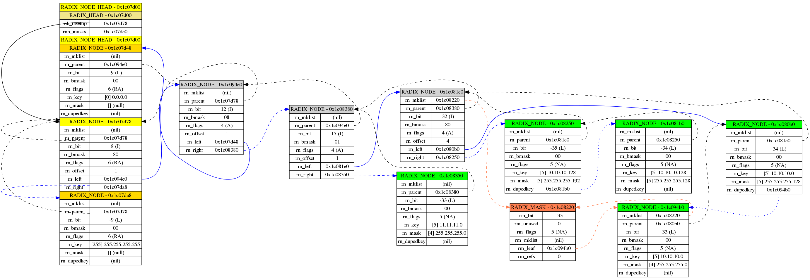
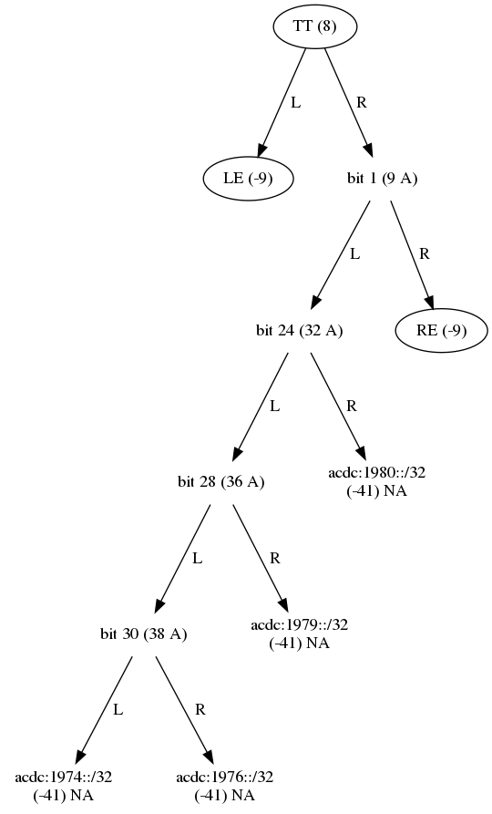

# iptable

A Lua longest prefix matching table for ipv4 and ipv6:

  - a single `table` to store both ipv4 and/or ipv6 prefixes
  - `assignment` is always based on an exact match
  - `indexing` in the table is either:
      - *exact*, when indexing with a prefix (that is with a
        `addr/len`), or
      - *longest prefix match*, when indexing with a bareaddress

## module functions

Requiring `iptable` yields an object with module level functions.

``` lua
iptable = require "iptable"
```

### `iptable.address(prefix)`

Returns the host address, mask length and address family given prefix.

``` lua
#!/usr/bin/env lua
iptable = require"iptable"
pfx4 = "10.10.10.0/19"
pfx6 = "2001:0db8:85a3:0000:0000:8a2e:0370:700/120"

ip, mlen, af = iptable.address(pfx4)
print(string.format("-- ip %s, mlen %s, af %s", ip, mlen, af))

ip, mlen, af = iptable.address(pfx6)
print(string.format("-- ip %s, mlen %s, af %s", ip, mlen, af))

print(string.rep("-", 35))

---------- PRODUCES --------------
```

``` lua
-- ip 10.10.10.0, mlen 19, af 2
-- ip 2001:db8:85a3::8a2e:370:700, mlen 120, af 10
-----------------------------------
```

### `iptable.network(prefix)`

Returns the network address, mask length and address family for given
prefix.

``` lua
#!/usr/bin/env lua
iptable = require"iptable"
pfx4 = "10.10.10.0/19"
pfx6 = "2001:0db8:85a3:0000:0000:8a2e:0370:700/120"

ip, mlen, af = iptable.network(pfx4)
print(string.format("-- ip %s, mlen %s, af %s", ip, mlen, af))

ip, mlen, af = iptable.network(pfx6)
print(string.format("-- ip %s, mlen %s, af %s", ip, mlen, af))

print(string.rep("-", 35))

---------- PRODUCES --------------
```

``` lua
-- ip 10.10.0.0, mlen 19, af 2
-- ip 2001:db8:85a3::8a2e:370:700, mlen 120, af 10
-----------------------------------
```

### `iptable.broadcast(prefix)`

Returns the broadcast address, mask length and address family for given
prefix.

``` lua
#!/usr/bin/env lua
iptable = require"iptable"
pfx4 = "10.10.10.0/19"
pfx6 = "2001:0db8:85a3:0000:0000:8a2e:0370:700/120"

ip, mlen, af = iptable.broadcast(pfx4)
print(string.format("-- ip %s, mlen %s, af %s", ip, mlen, af))

ip, mlen, af = iptable.broadcast(pfx6)
print(string.format("-- ip %s, mlen %s, af %s", ip, mlen, af))

print(string.rep("-", 35))

---------- PRODUCES --------------
```

``` lua
-- ip 10.10.31.255, mlen 19, af 2
-- ip 2001:db8:85a3::8a2e:370:7ff, mlen 120, af 10
-----------------------------------
```

### `iptable.incr(prefix [,offset])`

``` lua
#!/usr/bin/env lua
iptable = require"iptable"
pfx4 = "10.10.10.0/19"
pfx6 = "2001:0db8:85a3:0000:0000:8a2e:0370:700/120"

ip, mlen, af = iptable.incr(pfx4)
print(string.format("-- ip %s, mlen %s, af %s", ip, mlen, af))

ip, mlen, af = iptable.incr(pfx4, 10)
print(string.format("-- ip %s, mlen %s, af %s", ip, mlen, af))

ip, mlen, af = iptable.incr(pfx6, 5)
print(string.format("-- ip %s, mlen %s, af %s", ip, mlen, af))

print(string.rep("-", 35))

---------- PRODUCES --------------
```

``` lua
-- ip 10.10.10.1, mlen 19, af 2
-- ip 10.10.10.10, mlen 19, af 2
-- ip 2001:db8:85a3::8a2e:370:705, mlen 120, af 10
-----------------------------------
```

### `iptable.decr(prefix [, offset])`

``` lua
#!/usr/bin/env lua
iptable = require"iptable"
pfx4 = "10.10.10.0/19"
pfx6 = "2001:0db8:85a3:0000:0000:8a2e:0370:700/120"

ip, mlen, af = iptable.decr(pfx4, 1)
print(string.format("-- ip %s, mlen %s, af %s", ip, mlen, af))

ip, mlen, af = iptable.decr(pfx6, 1)
print(string.format("-- ip %s, mlen %s, af %s", ip, mlen, af))

print(string.rep("-", 35))

---------- PRODUCES --------------
```

``` lua
-- ip 10.10.9.255, mlen 19, af 2
-- ip 2001:db8:85a3::8a2e:370:6ff, mlen 120, af 10
-----------------------------------
```

### `iptable.interval(start, stop)`

``` lua
#!/usr/bin/env lua
iptable = require"iptable"

for pfx in iptable.interval("10.10.10.0", "10.10.10.12") do
    print("-- ", pfx)
end

print(string.rep("-", 35))

---------- PRODUCES --------------
```

``` lua
-- 	10.10.10.0/29
-- 	10.10.10.8/30
-- 	10.10.10.12/32
-----------------------------------
```

### `iptable.mask(af, mlen [, invert])`

``` lua
#!/usr/bin/env lua
iptable = require"iptable"

print(iptable.mask(2, 19))
print(iptable.mask(2, 19, true))

print(iptable.mask(10, 91))
print(iptable.mask(10, 91, true))


print(string.rep("-", 35))

---------- PRODUCES --------------
```

``` lua
255.255.224.0
0.0.31.255
ffff:ffff:ffff:ffff:ffff:ffe0::
::1f:ffff:ffff
-----------------------------------
```

### `iptable.neighbor(prefix)`

``` lua
#!/usr/bin/env lua
iptable = require"iptable"
pfx6 = "2001:0db8:85a3:0000:0000:8a2e:0370:700/120"

print(iptable.neighbor("10.10.0.0/19"))
print(iptable.neighbor("10.10.32.0/19"))
print(iptable.neighbor("10.10.10.255"))
print(iptable.neighbor("0.0.0.0/0"))      -- nothing larger than this
print(iptable.neighbor(pfx6))

print(string.rep("-", 35))

---------- PRODUCES --------------
```

``` lua
10.10.32.0	19	2
10.10.0.0	19	2
10.10.10.254	-1	2
nil
2001:db8:85a3::8a2e:370:600	120	10
-----------------------------------
```

### `iptable.size(...)`

``` lua
#!/usr/bin/env lua
iptable = require"iptable"
pfx6 = "2001:0db8:85a3:0000:0000:8a2e:0370:700/120"

print(iptable.size("10.10.10.0/24"))
print(iptable.size("10.10.0.0/31"))
print(iptable.size(pfx6))
print(iptable.size("2001::/0"))

print(string.rep("-", 35))

---------- PRODUCES --------------
```

``` lua
256.0
2.0
256.0
3.4028236692094e+38
-----------------------------------
```

### `iptable.tobin(prefix)`

``` lua
#!/usr/bin/env lua
iptable = require"iptable"
pfx4 = "10.10.0.0/19"
pfx6 = "2001:0db8:85a3:0000:0000:8a2e:0370:700/120"

bin2str = function(buf)
  local s = ""
  local len = buf:byte(1)
  for i = 1, len, 1 do
    s = string.format("%s:%02x", s, buf:byte(i));
  end
  return s:sub(2) -- skip leading ':'
end

bin4, mlen, af = iptable.tobin(pfx4)
bin6, mlen, af = iptable.tobin(pfx6)

print(bin2str(bin4))
print(bin2str(bin6))

print(string.rep("-", 35))

---------- PRODUCES --------------
```

``` lua
05:0a:0a:00:00
11:20:01:0d:b8:85:a3:00:00:00:00:8a:2e:03:70:07:00
-----------------------------------
```

### `iptable.masklen(binary_key)`

``` lua
#!/usr/bin/env lua
iptable = require"iptable"
pfx4 = "255.255.253.0"
pfx6 = "ffff:fffe::"

bin2str = function(buf)
  local s = ""
  local len = buf:byte(1)
  for i = 1, len, 1 do
    s = string.format("%s:%02x", s, buf:byte(i));
  end
  return s:sub(2) -- skip leading ':'
end

bin4, mlen4, af4 = iptable.tobin(pfx4)
bin6, mlen6, af6 = iptable.tobin(pfx6)

print(iptable.masklen(bin4), "consecutive 1's in:", bin2str(bin4))
print(iptable.masklen(bin6), "consecutive 1's in:", bin2str(bin6))

print(string.rep("-", 35))

---------- PRODUCES --------------
```

``` lua
22	consecutive 1's in:	05:ff:ff:fd:00
31	consecutive 1's in:	11:ff:ff:ff:fe:00:00:00:00:00:00:00:00:00:00:00:00
-----------------------------------
```

### `iptable.tostr(binary_key)`

``` lua
#!/usr/bin/env lua
iptable = require"iptable"
pfx4 = "255.255.253.0"
pfx6 = "ffff:fffe::"

bin2str = function(buf)
  local s = ""
  local len = buf:byte(1)
  for i = 1, len, 1 do
    s = string.format("%s:%02x", s, buf:byte(i));
  end
  return s:sub(2) -- skip leading ':'
end

bin4, mlen4, af4 = iptable.tobin(pfx4)
bin6, mlen6, af6 = iptable.tobin(pfx6)

print(iptable.tostr(bin4), " == ", pfx4)
print(iptable.tostr(bin6), " == ", pfx6)

print(string.rep("-", 35))

---------- PRODUCES --------------
```

``` lua
255.255.253.0	 == 	255.255.253.0
ffff:fffe::	 == 	ffff:fffe::
-----------------------------------
```

### `iptable.new()`

Constructor method that returns a new ipv4,ipv6 lookup table. Use it as
a regular table with modified indexing:

  - *exact* indexing is used for assignments or when the index has a
    masklength
  - *longest prefix match* if indexed with a bare host address

## table functions

### Basic operations

``` lua
#!/usr/bin/env lua
acl = require"iptable".new()

acl["10.10.10.0/24"] = true
acl["10.10.10.8/30"] = false

print("--> 1 exact match for prefix 10.10.10.0/24  ->", acl["10.10.10.0/24"])
print("--> 2 longest prefix match for 10.10.10.9   ->", acl["10.10.10.9"])
print("--> 3 longest prefix match for 10.10.10.100 ->", acl["10.10.10.100"])
print("--> 4 exact match for prefix 10.10.10.10/30 ->", acl["10.10.10.10/30"])
print(string.format("--> 5 acl has %s entries", #acl))

print(string.rep("-", 35))

---------- PRODUCES --------------
```

``` lua
--> 1 exact match for prefix 10.10.10.0/24  ->	true
--> 2 longest prefix match for 10.10.10.9   ->	false
--> 3 longest prefix match for 10.10.10.100 ->	true
--> 4 exact match for prefix 10.10.10.10/30 ->	false
--> 5 acl has 2 entries
-----------------------------------
```

### `ipt:more(prefix)`

``` lua
#!/usr/bin/env lua
ipt = require"iptable".new()

ipt["10.10.0.0/16"] = 1
ipt["10.10.9.0/24"] = 2
ipt["10.10.10.0/24"] = 3
ipt["10.10.10.0/25"] = 4
ipt["10.10.10.0/26"] = 5
ipt["10.10.10.128/30"] = 6

-- search more specifics only

for pfx in ipt:more("10.10.10.0/24") do
    print("-- exclusive search ->", pfx)
end
print()

-- search includes starting search prefix

for pfx in ipt:more("10.10.10.0/24", true) do
    print("-- inclusive search ->", pfx)
end

print(string.rep("-", 35))

---------- PRODUCES --------------
```

``` lua
-- exclusive search ->	10.10.10.0/26
-- exclusive search ->	10.10.10.0/25
-- exclusive search ->	10.10.10.128/30

-- inclusive search ->	10.10.10.0/26
-- inclusive search ->	10.10.10.0/25
-- inclusive search ->	10.10.10.0/24
-- inclusive search ->	10.10.10.128/30
-----------------------------------
```

### `ipt:less(prefix)`

``` lua
#!/usr/bin/env lua
ipt = require"iptable".new()

ipt["10.10.0.0/16"] = 1
ipt["10.10.9.0/24"] = 2
ipt["10.10.10.0/24"] = 3
ipt["10.10.10.0/25"] = 4
ipt["10.10.10.0/26"] = 5
ipt["10.10.10.128/30"] = 6

-- search less specifics only

for pfx in ipt:less("10.10.10.0/25") do
    print("-- exclusive search ->", pfx)
end
print()

-- search includes starting search prefix

for pfx in ipt:less("10.10.10.0/25", true) do
    print("-- inclusive search ->", pfx)
end

print(string.rep("-", 35))

---------- PRODUCES --------------
```

``` lua
-- exclusive search ->	10.10.10.0/24
-- exclusive search ->	10.10.0.0/16

-- inclusive search ->	10.10.10.0/25
-- inclusive search ->	10.10.10.0/24
-- inclusive search ->	10.10.0.0/16
-----------------------------------
```

### `ipt:merge(af)`

``` lua
#!/usr/bin/env lua
iptable = require "iptable"
ipt = iptable.new()

ipt["10.11.0.0/16"] = 1
ipt["10.10.9.0/24"] = 2
ipt["10.10.10.0/24"] = 3
ipt["10.10.10.0/25"] = 4
ipt["10.10.10.128/25"] = 5
ipt["10.10.10.0/30"] = 6
ipt["10.10.10.4/30"] = 7

-- find adjacent prefixes

for supernet, grp in ipt:merge(iptable.AF_INET) do
    print(string.format("-- supernet %s contains:", supernet))
    for subnet, val in pairs(grp) do
        print(string.format("   -- %s -> %s", subnet, val))
    end
end

print(string.rep("-", 35))

---------- PRODUCES --------------
```

``` lua
-- supernet 10.10.10.0/29 contains:
   -- 10.10.10.4/30 -> 7
   -- 10.10.10.0/30 -> 6
-- supernet 10.10.10.0/24 contains:
   -- 10.10.10.128/25 -> 5
   -- 10.10.10.0/25 -> 4
   -- 10.10.10.0/24 -> 3
-- supernet 10.10.10.0/29 contains:
   -- 10.10.10.4/30 -> 7
   -- 10.10.10.0/30 -> 6
-- supernet 10.10.10.0/24 contains:
   -- 10.10.10.128/25 -> 5
   -- 10.10.10.0/25 -> 4
   -- 10.10.10.0/24 -> 3
-----------------------------------
```

### `ipt:masks(af)`

``` lua
#!/usr/bin/env lua
iptable = require "iptable"
ipt = iptable.new()

ipt["10.10.0.0/16"] = 1
ipt["10.10.9.0/24"] = 2
ipt["10.10.10.0/24"] = 3
ipt["10.10.10.0/25"] = 4
ipt["10.10.10.0/26"] = 5
ipt["10.10.10.128/30"] = 6

-- iterate across masks in the trie
for pfx in ipt:masks(iptable.AF_INET) do
    print("-- mask ->", pfx)
end

print(string.rep("-", 35))

---------- PRODUCES --------------
```

``` lua
-- mask ->	255.255.0.0
-- mask ->	255.255.255.0
-- mask ->	255.255.255.128
-- mask ->	255.255.255.192
-- mask ->	255.255.255.252
-----------------------------------
```

### `ipt:counts()`

``` lua
#!/usr/bin/env lua
iptable = require "iptable"
ipt = iptable.new()

ipt["10.10.0.0/16"] = 1
ipt["10.10.9.0/24"] = 2
ipt["10.10.10.0/24"] = 3
ipt["10.10.10.0/25"] = 4
ipt["10.10.10.0/26"] = 5
ipt["10.10.10.128/30"] = 6
ipt["2001::dead:beef/120"] = 1
ipt["2002::dead:beef/120"] = 2
ipt["2003::dead:beef/120"] = 3

af4, af6 = ipt:counts()

print("-- num of ipv4 prefixes", af4)
print("-- num of ipv6 prefixes", af6)

print(string.rep("-", 35))

---------- PRODUCES --------------
```

``` lua
-- num of ipv4 prefixes	6
-- num of ipv6 prefixes	3
-----------------------------------
```

### `ipt:radixes(af[, masktree])`

``` lua
#!/usr/bin/env lua
iptable = require "iptable"
ipt = iptable.new()

ipt["10.10.0.0/16"] = 1
ipt["2003::dead:beef/120"] = 1

-- dump radix nodes in the radix trie
for rdx in ipt:radixes(iptable.AF_INET | iptable.AF_INET6) do
    print("-- tree exclusive", rdx._NAME_)
end
print()

-- also include the mask-tree
for rdx in ipt:radixes(iptable.AF_INET | iptable.AF_INET6, true) do
    print("-- tree inclusive", rdx._NAME_)
end

print(string.rep("-", 35))

---------- PRODUCES --------------
```

``` lua
-- tree exclusive	RADIX_NODE_HEAD
-- tree exclusive	RADIX_NODE
-- tree exclusive	RADIX_NODE

-- tree inclusive	RADIX_NODE_HEAD
-- tree inclusive	RADIX_NODE
-- tree inclusive	RADIX_NODE
-- tree inclusive	RADIX_MASK_HEAD
-- tree inclusive	RADIX_NODE
-- tree inclusive	RADIX_NODE
-----------------------------------
```

# Examples:

## Large tree graphs

### Graph an IPv4 tree

``` lua
#!/usr/bin/env lua

iptable = require "iptable"
dotify = require "src.lua.ipt2dot"
ipt = iptable.new()

ipt["10.10.10.0/24"] = 1
ipt["10.10.10.0/25"] = 2
ipt["10.10.10.128/25"] = 3
ipt["10.10.10.128/26"] = 4
ipt["11.11.11.0/24"] = 2


imgfile = arg[1]
dotfile = imgfile:gsub("...$", "dot")
dottext = dotify(ipt, iptable.AF_INET)

fh = io.open(dotfile, "w")
fh:write(table.concat(dottext, "\n"))
fh:close()

os.execute(string.format("dot -Tpng %s -o %s", dotfile, imgfile))
print(string.rep("-",35))

---------- PRODUCES --------------
```



### Graph an IPv6 tree

``` lua
#!/usr/bin/env lua

iptable = require "iptable"
dotify = require "src.lua.ipt2dot"
ipt = iptable.new()

ipt["acdc:1974::/32"] = "Can I sit next to you?"
ipt["acdc:1976::/32"] = "Jailbreak"
ipt["acdc:1979::/32"] = "Highway to hell"
ipt["acdc:1980::/32"] = "Touch too much"


imgfile = arg[1]
dotfile = imgfile:gsub("...$", "dot")
dottext = dotify(ipt, iptable.AF_INET6)

fh = io.open(dotfile, "w")
fh:write(table.concat(dottext, "\n"))
fh:close()

os.execute(string.format("dot -Tpng %s -o %s", dotfile, imgfile))
print(string.rep("-",35))

---------- PRODUCES --------------
```


## Small(er) tree graphs

### Graph an IPv4 tree

``` lua
#!/usr/bin/env lua

iptable = require "iptable"
dotify = require "src.lua.ipt2smalldot"
ipt = iptable.new()

ipt["10.10.10.0/24"] = 1
ipt["10.10.10.0/25"] = 2
ipt["10.10.10.128/25"] = 3
ipt["10.10.10.128/26"] = 4
ipt["11.11.11.0/24"] = 2


imgfile = arg[1]
dotfile = imgfile:gsub("...$", "dot")
dottext = dotify(ipt, iptable.AF_INET)

fh = io.open(dotfile, "w")
fh:write(table.concat(dottext, "\n"))
fh:close()

os.execute(string.format("dot -Tpng %s -o %s", dotfile, imgfile))
print(string.rep("-",35))

---------- PRODUCES --------------
```


### Graph an IPv6 tree

``` lua
#!/usr/bin/env lua

iptable = require "iptable"
dotify = require "src.lua.ipt2smalldot"
ipt = iptable.new()

ipt["acdc:1974::/32"] = "Can I sit next to you?"
ipt["acdc:1976::/32"] = "Jailbreak"
ipt["acdc:1979::/32"] = "Highway to hell"
ipt["acdc:1980::/32"] = "Touch too much"


imgfile = arg[1]
dotfile = imgfile:gsub("...$", "dot")
dottext = dotify(ipt, iptable.AF_INET6)

fh = io.open(dotfile, "w")
fh:write(table.concat(dottext, "\n"))
fh:close()

os.execute(string.format("dot -Tpng %s -o %s", dotfile, imgfile))
print(string.rep("-",35))

---------- PRODUCES --------------
```



## Minify list of prefixes

``` lua
#!/usr/bin/env lua
iptable = require "iptable"

-- fill a table with list of prefixes
ipt = iptable.new()
ipt["10.10.10.0/25"] = true
ipt["10.10.10.128/25"] = true
ipt["10.10.11.0/25"] = true
ipt["10.10.11.128/25"] = true
ipt["11.11.11.0"] = true
ipt["11.11.11.1"] = true
ipt["11.11.11.2"] = true
ipt["11.11.11.3"] = true

for k,_ in pairs(ipt) do
    print("-- original ->", k)
end
print()

changed = true
while (changed) do
    changed = false
    for supernet, grp in ipt:merge(iptable.AF_INET) do
        for subnet, _ in pairs(grp) do
            ipt[subnet] = nil
            changed = true
         end
         ipt[supernet] = true
    end
end

for prefix, _ in pairs(ipt) do
    for subnet, _ in ipt:more(prefix, false) do
        ipt[subnet] = nil
    end
end

for k, _ in pairs(ipt) do
    print("-- minified ->", k)
end

print(string.rep("-",35))

---------- PRODUCES --------------
```

``` lua
-- original ->	10.10.10.0/25
-- original ->	10.10.10.128/25
-- original ->	10.10.11.0/25
-- original ->	10.10.11.128/25
-- original ->	11.11.11.0/32
-- original ->	11.11.11.1/32
-- original ->	11.11.11.2/32
-- original ->	11.11.11.3/32

-- minified ->	10.10.10.0/23
-- minified ->	11.11.11.0/30
-----------------------------------
```
